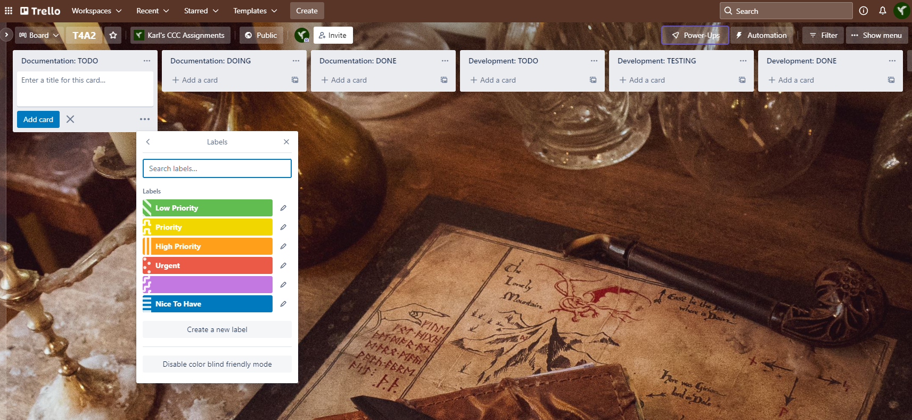

# T4A2_Final
Full Stack Application - Final Assignment for CCC

---

# Sindarin Translator Online

## Description

_Sindarin Translator Online_ aims to provide a web interface for the terminal application created during term 2 in the CCC course (T2A3). You can find more details about that project [here](https://github.com/Kei-Eff/sindarin-translator).

## Functionality / Features

* English-to-Sindarin (Tolkien _Elvish_) translations
* Responsive website
* 

## Target Audience

* Fans of JRR Tolkien's written works, and the 'Lord of the Rings' universe.
* Fans of the 'Lord of the Rings' and 'The Hobbit' movie franchises.
* Fans who are interested in the upcoming 'Rings of Power' _Amazon Prime Video_ series.
* Fans of _Conlangs_ (Constructed Languages) who want a phonetic representation of the _Elvish Sindarin_ language.

* Future employers _(hi there!)_
* Coder Academy educators for marking purposes.

## Tech Stack

* HTML5 + CSS Frontend
* Python 3
* Flask or Django web framework
* Git
* AWS EC2
* AWS Lambda

## Dataflow Diagram

## Application Architecture Diagram

## Wireframes

### Mobile

### Desktop

## Trello Board

### 19 February 2022

Project Start (with Priority Labels)

Updated Documentation Tasks

---

Karl Alberto | 2022