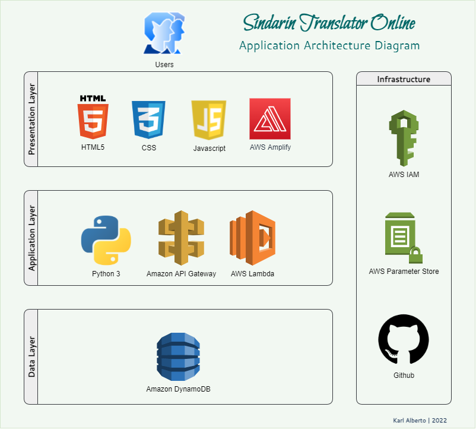

CCC-2022 T4A2 - Full Stack Application - Karl Alberto

---

# Sindarin Translator Online

## Description

_Sindarin Translator Online_ aims to provide a web interface for the terminal application I created in Term 2 (2021) for the CCC course (T2A3). You can find more details about that project [here](https://github.com/Kei-Eff/sindarin-translator).

Documentation and Development updates are available via Trello [here](https://trello.com/b/5FlPl44f/t4a2-sindarin-translator-online), along with screenshots below.

 

## Main Functionality/Features

* English-to-Sindarin (Tolkien _Elvish_) translations
* Easy to use, responsive website
* Minimal design: text in, text out
* ~~About page (including contact form)~~ _Removed 23.02.2022_
* ~~Links to contact and portfolio items (namely, Github and LinkedIn)~~ _Removed 23.02.2022_

Updated 24.02.2022:

* Cache for most requested translations (to limit API calls)

## Future Improvements/Additional Features

* ~~Store and display last 10 and/or top 10 translations requested~~ _Removed 24.02.2022_

* More Middle Earth language options:
    * English-to-_Quenya_
    * English-to-_Orcish_

* Output text in _Tengwar_ (Elvish) script

 

## Target Audience

* Fans of J.R.R. Tolkien's written works, and the 'Middle Earth'/'Lord of the Rings' universe.
* Fans of the 'Lord of the Rings' and 'The Hobbit' movie franchises.
* Fans who are interested in the upcoming 'Rings of Power' _Amazon Prime Video_ series.
* Fans of _Conlangs_ (Constructed Languages) who want a phonetic representation of the _Elvish Sindarin_ language.
* Linguists and linguistics students who want to study how Tolkien created his own languages.
* Fans of video games set in Middle Earth.

 

## Tech Stack

* HTML5
* CSS
* Javascript
* Python 3
* ~~Flask or Django web framework~~ _Removed 24.02.2022_
* Github
* AWS Identity and Access Manager
* AWS Amplify
* Amazon API Gateway
* ~~AWS EC2~~ _Removed 25.02.2022_
* AWS Lambda
* Amazon DynamoDB
* AWS Parameter Store

 

## Dataflow Diagram

PDF version available [here](https://drive.google.com/file/d/12M_AjIVeAlF6yyiZiKg_ZUP8SYS7ouDh/view?usp=sharing). Older version is available to view [here](./docs/sto_old_versions.md).

 

## Application Architecture Diagram

PDF version available [here](https://drive.google.com/file/d/1GyclfPDHQPcAUzzXO_8p2HwB6HThrn9P/view?usp=sharing).

 

## User Stories

|                                                                                                                                                             |
| ---------------------------------------------------------------------------------------------------------------------------------------------------------------- |
| As a fan of J.R.R. Tolkien's written works, I want to be able to immerse myself in the Elven lore through their language.                                        |
| As a fan of the Lord of the Rings series of books, I want to speak the same language as Lord Elrond!                                                             |
| As a linguist studying 'Constructed Languages', I want to study the syntax Tolkien developed for his books.                                                      |
| As an Elven LARPer, I really want to up my spellcasting game by using Sindarin!                                                                                  |
| As an older fan of Tolkien's books, I want to be able to use Elven words conveniently on my phone.                                                               |
| As a DM (Dungeon Master), I want to regale my players with Sindarin speech during one of our DND One-Shots.                                                      |
| As a language student, I want a source to study popular ConLangs while I commute.                                                                                |
| As someone who only reads Tolkien-related fiction, I want to have a dedicated app for his Elven languages, and not sort through other universes (like Star Trek) |
| As a gamer who loves the Shadow of Mordor/War series of games, I want to understand some of the words they use!                                                  |
---

 

## Wireframes

PDF version available [here](https://drive.google.com/file/d/10v8T_PIrClSegHbf481wlN-TLrklgsCH/view?usp=sharing). Older versions are available to view [here](./docs/sto_old_versions.md).

### Mobile

Basic app wireframes based off of _Google Translate_ interface.

### Desktop

Based heavily off the mobile version, for easy implementation of a responsive site.

 

## Progress Updates: Trello

_N.B. Updates from February 2022 can now be found [here](./docs/trello_updates_feb_2022.md)._

Priority labels as follow:

    * Low Priority
    * Priority (default)
    * High Priority
    * Urgent
    * Ongoing
    * Nice to Have
    * CRITICAL

### 1 March 2022

Tackling page layout

### 2 March 2022

Added highline development tasks

More development task cards added. Shifted some dates

### 3 March 2022

### 4 March 2022

Testing started for some components

 

---

Karl Alberto | 2022