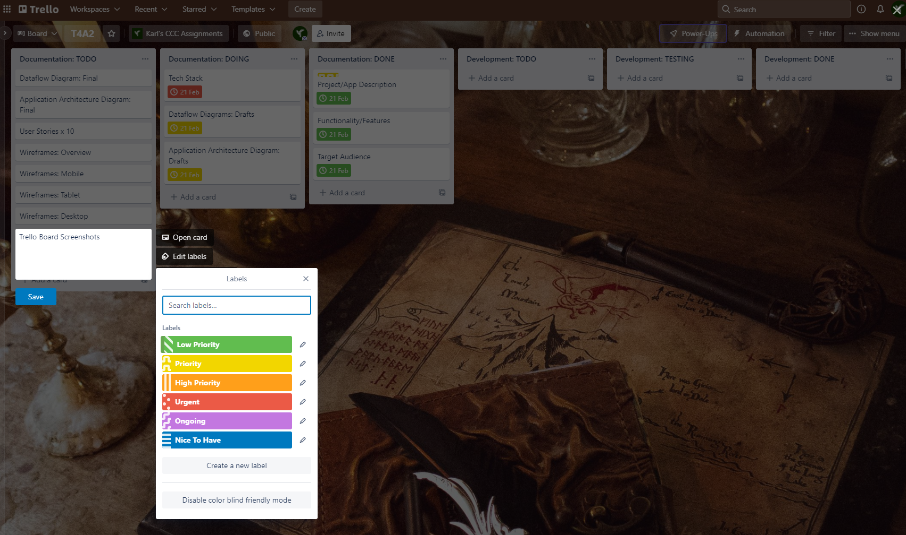
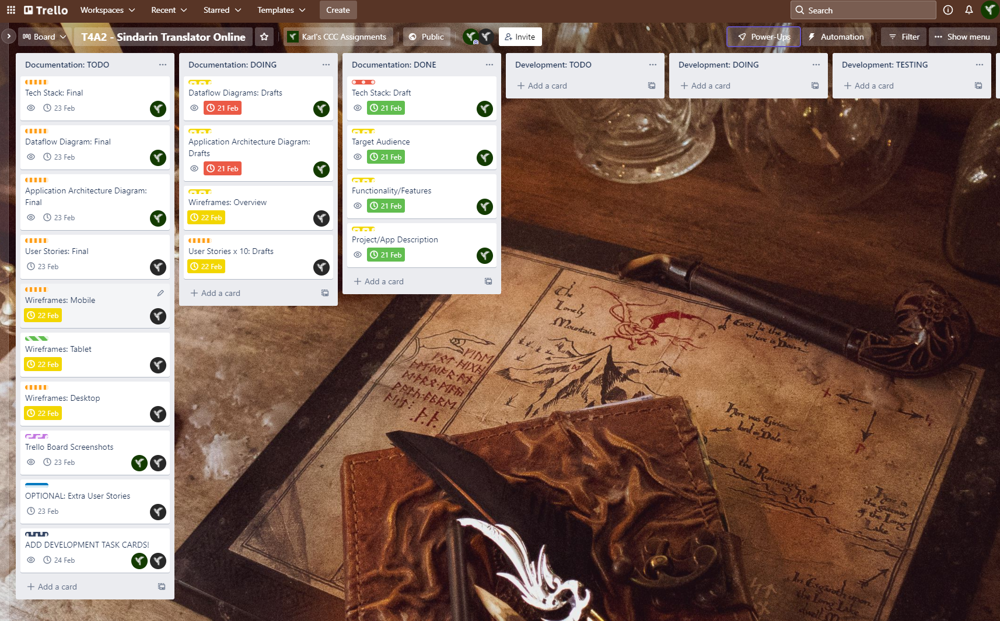
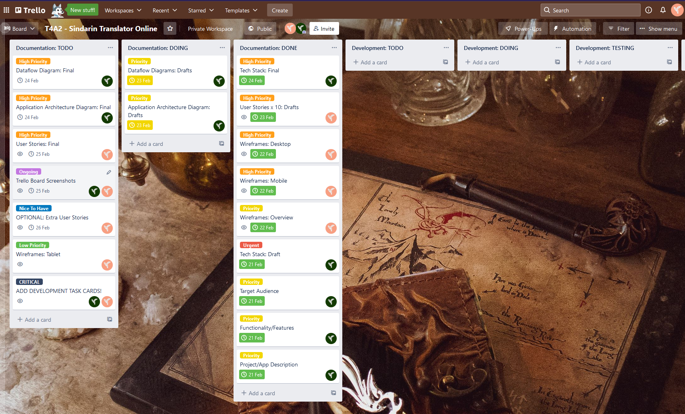

CCC-2022 T4A2 - Full Stack Application - Karl Alberto

---

# Sindarin Translator Online

## Description

_Sindarin Translator Online_ aims to provide a web interface for the terminal application created during term 2 in the CCC course (T2A3). You can find more details about that project [here](https://github.com/Kei-Eff/sindarin-translator).

Documentation and Development updates are available via Trello [here](https://trello.com/b/5FlPl44f/t4a2-sindarin-translator-online), along with screenshots below.

## Main Functionality/Features

* English-to-Sindarin (Tolkien _Elvish_) translations
* Easy to use, responsive website
* Minimal design: text in, text out
* ~~About page (including contact form)~~ _Removed 23.02.2022_
* ~~Links to contact and portfolio items (namely, Github and LinkedIn)~~ _Removed 23.02.2022_

Updated 24.02.2022:

* Cache for most requested translations (to limit API calls)

## Future Improvements/Additional Features

* ~~Store and display last 10 and/or top 10 translations requested~~ _Removed 24.02.2022_

* More Middle Earth language options:
    * English-to-_Quenya_
    * English-to-_Orcish_

* Output text in _Tengwar_ (Elvish) script

## Target Audience

* Fans of JRR Tolkien's written works, and the 'Lord of the Rings' universe.
* Fans of the 'Lord of the Rings' and 'The Hobbit' movie franchises.
* Fans who are interested in the upcoming 'Rings of Power' _Amazon Prime Video_ series.
* Fans of _Conlangs_ (Constructed Languages) who want a phonetic representation of the _Elvish Sindarin_ language.

## Tech Stack

* HTML5
* CSS
* Javascript
* Python 3
* ~~Flask or Django web framework~~ _Removed 24.02.2022_
* Github
* AWS Identity and Access Manager
* AWS Amplify
* Amazon API Gateway
* ~~AWS EC2~~ _Removed 25.02.2022_
* AWS Lambda
* Amazon DynamoDB
* AWS Parameter Store

## Dataflow Diagram

PDF version available [here](https://drive.google.com/file/d/12M_AjIVeAlF6yyiZiKg_ZUP8SYS7ouDh/view?usp=sharing). Older version is available to view [here](./docs/sto_old_versions.md).

## Application Architecture Diagram

PDF version available [here](https://drive.google.com/file/d/1GyclfPDHQPcAUzzXO_8p2HwB6HThrn9P/view?usp=sharing).

## User Stories

## Wireframes

PDF version available [here](https://drive.google.com/file/d/10v8T_PIrClSegHbf481wlN-TLrklgsCH/view?usp=sharing). Older versions are available to view [here](./docs/sto_old_versions.md).

### Mobile

Basic app wireframes based off of _Google Translate_ interface.

### Desktop

## Progress Updates: Trello

### 19 February 2022

Project Start (with Priority Labels)

Priority labels as follow:

    * Low Priority
    * Priority (default)
    * High Priority
    * Urgent
    * Ongoing
    * Nice to Have
    * CRITICAL (added 21.02.2022)

### 20 February 2022

Updated Documentation Tasks

### 21 February 2022

Added 'CRITICAL' priority label

Added extra "team member" and assigned tasks

### 22 February 2022

Updated date targets + tasks

### 23 February 2022

### 24 February 2022

Updated and added tasks

### 25 February 2022

Updated Tech Stack

---

Karl Alberto | 2022