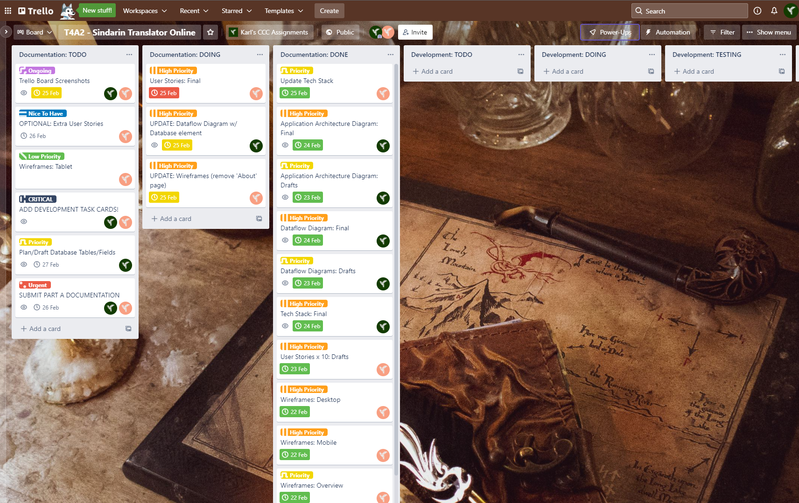

CCC-2021 T4A2 - Full Stack Application - Karl Alberto

---

# Trello Updates - February 2022

Trello updates from Part A of assignment; 20/02/2022 - 25/02/2022

### 19 February 2022

Project Start (with Priority Labels)

Priority labels as follow:

    * Low Priority
    * Priority (default)
    * High Priority
    * Urgent
    * Ongoing
    * Nice to Have
    * CRITICAL (added 21.02.2022)

### 20 February 2022

Updated documentation tasks:

### 21 February 2022

Added 'CRITICAL' priority label:

Added extra "team member" and assigned tasks:

### 22 February 2022

Updated date targets and tasks:

### 23 February 2022

### 24 February 2022

Updated and added tasks:

### 25 February 2022

Updated Tech Stack:

T4A2-A Ready for submission:

 

---

Karl Alberto | 2022